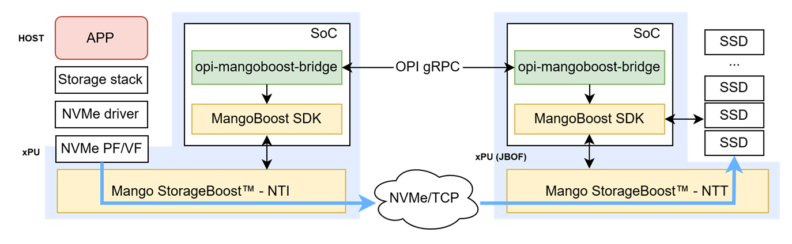

# OPI gRPC to Mangoboost Bridge

This repo includes OPI Mangoboost bridge API for DPUs, particularly OPI storage APIs for NVMe/TCP initiator and target offloads.
For additional information, please refer to the links below.

- [Mango StorageBoost - NTI](https://www.mangoboost.io/products/hardware/mango-storageboost-tm-nti)
- [Mango StorageBoost - NTT](https://www.mangoboost.io/products/hardware/mango-storageboost-tm-ntt)

The diagram below demonstrates an example of OPI-enabled workflows for xPU-based NVMe-oF initiator and target deployments.
Running on an xPU, the bridge translates and forwards OPI API commands to the MangoBoost SDK for service management and configuration.
On both the initiator and target, the NVMe/TCP data path is fully offloaded to the xPU hardware without any involvement of host and SoC CPU cores.

## Getting started

:exclamation: `docker-compose` is deprecated. For details, see [Migrate to Compose V2](https://docs.docker.com/compose/migrate/).

Run `docker-compose up -d` or `docker compose up -d`

## Usage

TBU

## I Want To Contribute

This project welcomes contributions and suggestions.  We are happy to have the Community involved via submission of **Issues and Pull Requests** (with substantive content or even just fixes). We are hoping for the documents, test framework, etc. to become a community process with active engagement.  PRs can be reviewed by by any number of people, and a maintainer may accept.

See [CONTRIBUTING](https://github.com/opiproject/opi/blob/main/CONTRIBUTING.md) and [GitHub Basic Process](https://github.com/opiproject/opi/blob/main/doc-github-rules.md) for more details.
